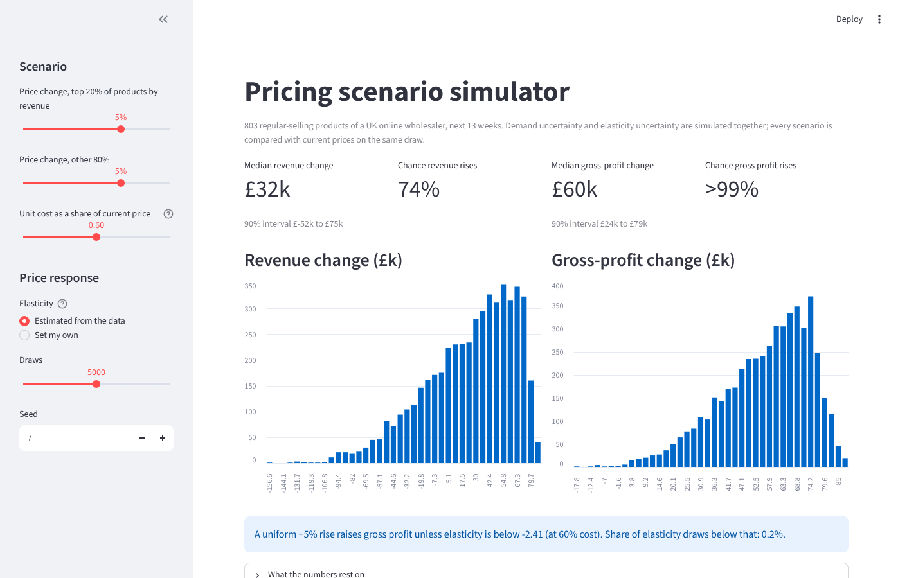
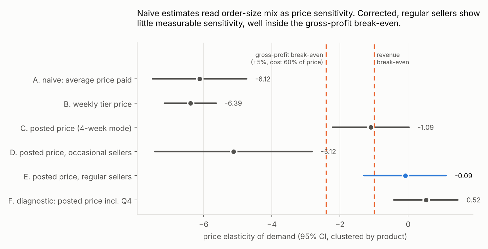
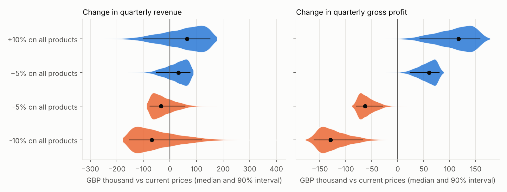
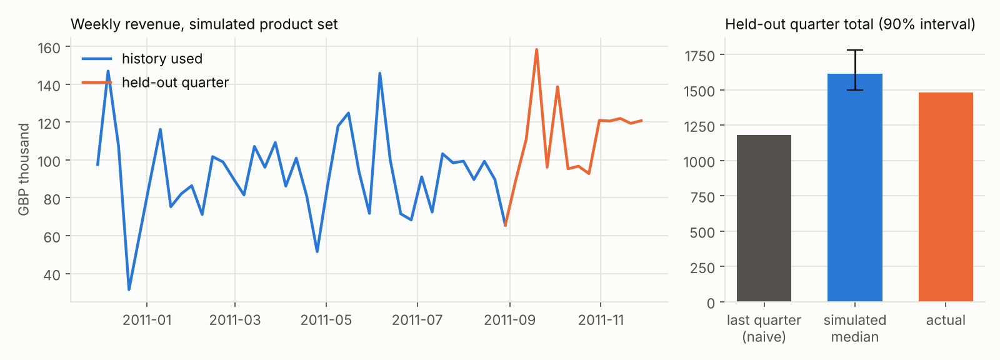

# Pricing Scenario Simulator

What happens to next quarter's revenue and gross profit if we change prices, and how sure can we be?

This project answers that question on **541,909 real invoice lines** from a UK online wholesaler (UCI Online Retail, December 2010 to December 2011). It is built in Python and SQL, and every number below is regenerated by one command.

It has four parts:

1. **SQL layer.** It cleans the data, builds a product-week panel and runs data-quality gates.
2. **Price elasticity.** It estimates how demand responds to price, and corrects a bias that would otherwise reverse the pricing decision.
3. **Demand baseline.** It backtests a gradient-boosting forecaster against naive baselines on two held-out quarters.
4. **Monte Carlo simulation.** For each scenario it simulates revenue and gross profit, combining demand uncertainty with elasticity uncertainty and comparing every draw with current prices.

An interactive Streamlit dashboard sits on top.



## Findings

**1. The obvious analysis gives the wrong answer.** Regressing units on the average price paid gives an elasticity of **-6.1**. Taken at face value, a 5% price rise would lose about a quarter of units, and the business should cut prices.

The number is an artifact. The retailer sells on a quantity-tier price list: the same product costs less per unit in a large order. In weeks when bulk buyers arrive, the average price falls and units jump together, and the regression reads order-size mix as price sensitivity.

Measuring price as the **posted list price** removes this. The posted price is the modal price within the product's main tier, held until a new price wins a majority of a 4-week window. With that measure, regular sellers show little measurable price sensitivity: **-0.09**, 95% CI -1.29 to 1.12.



**2. The pricing decision is robust even though the elasticity is uncertain.**

Across the simulated draws, a **+5% price rise** on regular sellers has these effects:

- **Gross profit** rises in 99.6% of draws: median **+£60k per quarter**, 90% interval +£23k to +£79k, assuming unit cost is 60% of price.
- **Revenue** rises in 74% of draws: median +£32k, 90% interval -£53k to +£76k.

The reason is the break-even point. A 5% rise only loses gross profit if elasticity is below **-2.41**, and the data puts almost no weight there.

Price cuts are the mirror image: a 5% cut loses gross profit in 99.8% of draws.



**3. Machine learning beats the baseline week-ahead, but not over a quarter.** A Poisson gradient-boosting model on lagged demand features was compared with simple baselines:

| Horizon | Gradient boosting (WAPE) | Baseline (WAPE) | Winner |
|---|---|---|---|
| Next week, Q4 | 0.599 | 0.659 (4-week mean) | Gradient boosting |
| Full quarter | 0.466 | 0.429 (last quarter repeated) | Baseline |

Week-ahead, gradient boosting is useful for replenishment. Rolled forward over a full quarter it loses, so the simulator uses the naive baseline for planning. With one year of history, there is no seasonality for a model to learn.



Full tables: [reports/results.md](reports/results.md).

## How it works

```
raw invoice lines (xlsx)
  -> sql/01_clean_lines.sql      cancellations, fees, zero prices, untracked channel, partial last week removed
  -> sql/02_product_week.sql     units, revenue, average price, within-tier price, customers per product-week
  -> sql/03_quality_checks.sql   gates: the pipeline stops if any check returns a violation
  -> elasticity.py               two-way fixed effects (product + week), SEs clustered by product,
                                 estimated only on weeks before the test quarter
  -> forecast.py                 gradient boosting vs naive, backtested; growth vectors for uncertainty
  -> simulate.py                 Monte Carlo: demand sample x elasticity draw, paired with the status quo
  -> report.py / streamlit app   figures, results.md, interactive scenarios
```

Design choices that matter:

- **The elasticity carries model uncertainty as well as sampling uncertainty.** Draws pool four posted-price definitions (3, 4, 6 and 8-week windows), because the choice of window moves the estimate. Positive values (demand rising with price) are ruled out. This is the conservative choice for a price rise, and the unrestricted result is reported alongside.
- **Every scenario is compared with the status quo on the same demand draw and the same elasticity draw.** The difference then isolates the price effect, not the noise in the quarter's level.
- **Demand uncertainty keeps the correlation between products.** Quarter-on-quarter growth is resampled as whole vectors, one per historical weekly origin, so a good or bad quarter for the whole shop is simulated as one.

## How it was validated

- **Synthetic data with a known answer.** The test suite builds a panel with a true elasticity of -1.5 and the same order-mix mechanism.
  - The naive estimate lands near -3.
  - The four posted-price windows bracket the truth.
  - Their pooled estimate recovers it within 0.25 (`tests/test_elasticity.py`).
- **Out-of-time backtests.** The forecasters are tested on two held-out quarters. The elasticity used for the planning quarter is estimated without any of its weeks.
- **21 automated tests** cover the following:
  - the SQL cleaning rules and the reconciliation of revenue with invoice lines;
  - a quality gate that is sabotaged on purpose and must stop the run;
  - the posted price using no future data;
  - forecast features using no future data;
  - the simulator's invariants: no price change means no change, unit-elastic demand keeps revenue flat, and the break-even elasticity is exactly break-even.

## Limitations

- **One year of data.** For Q4, actual revenue (£1,482k) came in just below the 5th percentile (£1,497k) of the simulated range.
  - At product level, the 90% intervals covered only 41% of products: product-level uncertainty is understated.
  - The pricing comparison is paired, so it is much less exposed to this than the level forecast. A second year of history is the first thing to add.
- **The elasticity is observational.**
  - It is identified from 66 regular sellers whose list price changed.
  - List-price changes can coincide with demand shifts. Including Q4 (diagnostic F) flips the sign, because seasonal items were repriced into the peak.
  - On synthetic data the pooled estimate is slightly attenuated (closer to zero than the truth), so true sensitivity may be somewhat higher. The gross-profit break-even (-2.41) is far from the estimate, so the conclusion survives this.
- **Occasional sellers are excluded.** Products with 20 to 29 selling weeks give an implausible -5.1.
  - A likely but untested explanation is end-of-life items, which are repriced while demand winds down.
  - The simulator therefore covers 803 regular sellers, 48% of the quarter's revenue.
- **No cost data.** Gross profit assumes cost is 60% of price. The break-even table in `results.md` shows the result from 40% to 80%.
- **No cross-price effects or competitor response.** Each product's demand responds only to its own price.

The next step for a real decision would be a **randomised price test** on a subset of regular sellers. It would replace the observational elasticity with an experimental one, and the simulator already takes any elasticity distribution as input.

## Run it

```bash
pip install -e ".[app,dev]"
python scripts/fetch_data.py                                # UCI Online Retail -> data/raw/
python -m pricesim.pipeline --raw "data/raw/Online Retail.xlsx"
python -m pricesim.report                                   # figures + reports/results.md
pytest -q
streamlit run app/streamlit_app.py
```

The processed panel and simulation inputs are committed under `data/processed/`, so the dashboard and the report run without downloading anything. The full pipeline takes about 15 seconds on a laptop.

```
sql/                 cleaning, panel, quality gates
src/pricesim/        data, elasticity, forecast, simulate, pipeline, report
app/                 Streamlit dashboard
tests/               21 tests, including the synthetic identification test
reports/             results.json, results.md, csv tables, figures
```

## Data

Chen, D. (2015). *Online Retail* [Dataset]. UCI Machine Learning Repository. https://doi.org/10.24432/C5BW33. Licensed CC BY 4.0. The results in `reports/` were produced from an identical copy of the 541,909 lines.

MIT licence for the code.
